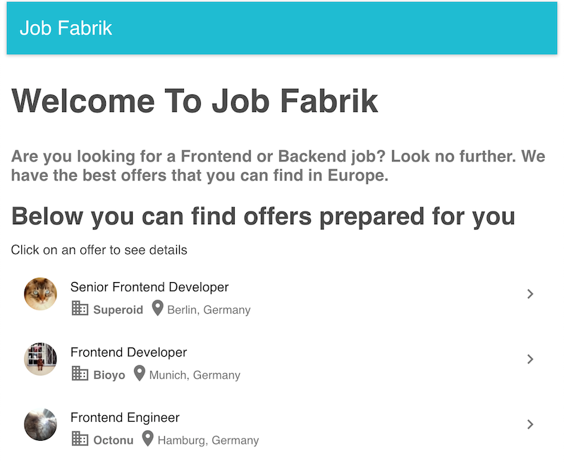

## HeyJobs test automation task
Thanks for taking the time to complete this test task! The purpose of the task is to assess your automation skills, i.e. development style, code organization, project structure.

## Background
_Job Fabrik_ is a simple React/Redux application. To run the app on your machine you can use yarn or npm.

#### Running with yarn

```
yarn start
```

#### Running with npm
```
npm start
```

Application will be available on `localhost:3333`



## ToDo
1. Clone the project
2. Set up [wdio](http://webdriver.io/)
3. Write automated tests for the following cases:
    * When users open the job list, they can see a list of 5 jobs with pictures, company names and locations.
    * After users click on a job from the list, they can see job details.
    * Users can navigate back from a job details page to the job list
    * Users see error message when they visit an unknown URL e.g. `http://localhost:3333/foo`
4. Send a link with the solution to your contact person inside HeyJobs. **Note!** Don't fork the repository or create pull requests. Please set up a new repository for the test task.
